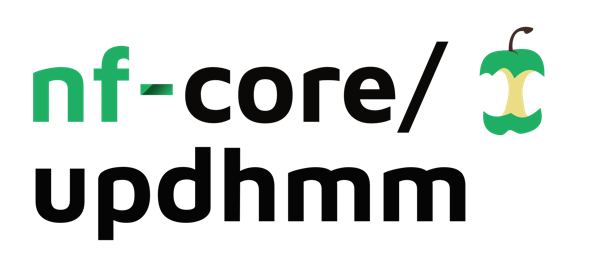

<h1>
  <picture>
    <source media="(prefers-color-scheme: dark)" srcset="docs/images/nf-core-updhmm_logo_dark.png">
    
  </picture>
</h1>

[](https://github.com/nf-core/updhmm/actions/workflows/ci.yml)
[](https://github.com/nf-core/updhmm/actions/workflows/linting.yml)[](https://nf-co.re/updhmm/results)[](https://doi.org/10.5281/zenodo.XXXXXXX)
[](https://www.nf-test.com)

[](https://www.nextflow.io/)
[](https://github.com/nf-core/tools/releases/tag/3.3.1)
[](https://docs.conda.io/en/latest/)
[](https://www.docker.com/)
[](https://sylabs.io/docs/)
[](https://cloud.seqera.io/launch?pipeline=https://github.com/nf-core/updhmm)

[](https://nfcore.slack.com/channels/updhmm)[](https://bsky.app/profile/nf-co.re)[](https://mstdn.science/@nf_core)[](https://www.youtube.com/c/nf-core)

---
## Introduction

**CIBERER/GdTBioinfo-nf-UPDhmm** is a best-practice analysis pipeline for the **detection of uniparental disomy (UPD)** in trio sequencing data, using [UPDhmm](https://github.com/saraamenasantamaria/UPDhmm-project) and additional preprocessing and postprocessing steps tailored to clinical datasets.

The pipeline is built using [Nextflow](https://www.nextflow.io) DSL2, enabling portability across HPC and cloud infrastructures. Each process runs within its own container, ensuring reproducibility and simplifying software management. Containers from [Biocontainers](https://biocontainers.pro/) are used whenever possible.  

Where appropriate, modules are reused or patched from [nf-core/modules](https://github.com/nf-core/modules); custom modules are implemented locally following nf-core guidelines.

---

## Pipeline summary

This pipeline standardizes the detection of uniparental disomy (UPD) events in trio sequencing data.  
It includes preprocessing of raw VCF files to ensure compatibility with the UPDhmm R package, application of UPDHmm Biocondcutor package (a Hidden Markov Model to detect UPD segments), and postprocessing filters to refine the final set of events.

Default steps:

1. **Preprocessing (`PREPROCESS_VCF`)**  
   Prepares the trio data by combining individual VCFs (if required) and applying filters to keep only high-quality biallelic SNVs.  
   - `combineVCF` – merges the VCFs from father, mother, and proband into a joint file.  
   - `filterStructuralVariants` *(optional)* – removes variants overlapping large structural changes.  
   - `filterRefHomozygotes` – excludes variants homozygous for the reference allele in all trio members.  
   - `checkVariantQuality` – filters variants by minimum genotype quality (GQ) and depth (DP).  
   - `filterCentromericRegions` – removes variants within centromeric and pericentromeric regions.  
   - `filterSegmentalDupsHLAKIR` – excludes segmental duplications and highly polymorphic HLA/KIR regions.  
   - `selectBialellicVariants` – select only bialellic variant combinations.  

2. **UPD detection (`CALCULATE_EVENTS`)**  
   Runs the UPDhmm core functions to detect genomic blocks consistent with UPD.  
   - `vcfCheck` – validates and formats the combined VCF as a `largeCollapsedVcf` object. It also assigns the roles of **proband**, **father**, and **mother** to the samples, based on the provided samplesheet.
   - `calculateEvents` – applies the HMM (Viterbi algorithm) to infer hidden states, groups variants into blocks, and annotates each block with confidence metrics.  

3. **Postprocessing (`POSTPROCESS_EVENTS`)**  
   Refines the set of candidate UPD events.
   - `filterLowConfidenceEvents` – removes small events or those with insufficient Mendelian errors.  
   - `mergeOverlappingEvents` – merges overlapping blocks of the same UPD type within a chromosome.  

> Each step is implemented as a separate DSL2 module. Outputs are organized by step and method.

---

## Usage

### Input samplesheet

Prepare a **CSV file** with your input data.  
Each row represents a family (trio), with identifiers for father, mother, and proband, and paths to the corresponding VCFs.  
Structural variant VCFs can also be included (set to `-` if not available).

`samplesheet.csv`:

```csv
fam_id,proband_id,mother_id,father_id,path_vcf_proband,path_vcf_mother,path_vcf_father,path_sv_proband,path_sv_mother,path_sv_father
FAM001,FAM001_PROBAND,FAM001_MOTHER,FAM001_FATHER,/path/to/proband.vcf.gz,/path/to/mother.vcf.gz,/path/to/father.vcf.gz,/path/to/proband.bed,/path/to/mother.sv.bed,/path/to/father.sv.bed
```

**Field description:**

- fam_id: family identifier  
- proband_id: proband sample identifier
- mother_id: mother sample identifier   
- father_id: father sample identifier  
- path_vcf_proband: SNV VCF file for the proband
- path_vcf_mother: SNV VCF file for the mother  
- path_vcf_father: SNV VCF file for the father   
- path_sv_proband: structural variant VCF for the proband (- if not available)
- path_sv_mother: structural variant VCF for the mother (- if not available)
- path_sv_father: structural variant VCF for the father (- if not available)  


Then, you can run the pipeline using:

<!-- TODO nf-core: update the following command to include all required parameters for a minimal example -->

```bash
nextflow run nf-core/updhmm \
   -profile <docker/singularity/.../institute> \
   --input samplesheet.csv \
   --outdir <OUTDIR>
```

## Output summary

For each trio, the pipeline generates two main tab-delimited files:  

1. **Raw events (`<trio>.raw.txt`)**  
   Direct output of the `UPDhmm::calculateEvents` function. This file contains all detected UPD candidate events without additional filtering.  

The core UPDhmm function, `calculateEvents`, returns a **data.frame** containing all detected UPD events for a given trio.  
If no events are found, an empty data.frame is returned.  

**Output columns:**  

| Column name          | Description                                                                 |
|----------------------|-----------------------------------------------------------------------------|
| seqnames             | Chromosome                                                                 |
| start                | Start position of the block                                                |
| end                  | End position of the block                                                  |
| n_snps               | Number of variants within the event                                        |
| group                | Predicted UPD state (e.g. iso_mat, het_fat)                                |
| log_likelihood       | Log likelihood ratio for the inferred block                                |
| p_value              | Statistical significance of the event                                      |
| n_mendelian_error    | Number of Mendelian errors supporting the event                            |


2. **Collapsed events (`<trio>.collapsed.txt`)**  
   Postprocessed and filtered results. Overlapping events of the same type within the same chromosome (e.g. paternal isodisomy) are merged into a single representative block.  
   Additional columns report the start and end coordinates of the merged region, together with a semicolon-separated list of all original raw events collapsed.


**Example collapsed output:**  

| chromosome | UPD type | n_events | total_mendelian_error | collapsed_event_ranges                                      | min_start | max_end   |
|------------|----------|----------|-----------------------|-------------------------------------------------------------|-----------|-----------|
| chr12      | iso_mat  | 2        | 108                   | chr12:16885604-25756939; chr12:25866874-29838830             | 16885604  | 29838830  |
| chr17      | het_mat  | 1        | 3                     | chr17:45990746-46714277                                     | 45990746  | 46714277  |
| chr7       | het_mat  | 1        | 11                    | chr7:55624055-56153077                                      | 55624055  | 56153077  |
| chr2       | het_fat  | 1        | 3                     | chr2:89791539-96090799                                      | 89791539  | 96090799  |


## Test execution

You can test the pipeline using the small example dataset provided in this repository.  
The test dataset contains two trios (subset of a single chromosome):  
- One trio includes a **simulated UPD event**  
- The other trio is a **negative control** without UPD  

The dataset is available at [Zenodo (10.5281/zenodo.17193905)](https://zenodo.org/records/17193905).  

Run the pipeline in **test mode** with:  

```bash
nextflow run nf-core/updhmm \
   -profile <docker/singularity>,test \
   --outdir <OUTDIR>


## Credits

nf-core/updhmm was originally written by Marta Sevilla Porras, Sara Mena Santamaría  and Carlos Ruiz Arenas.


## Contributions and Support

If you would like to contribute to this pipeline, please see the [contributing guidelines](.github/CONTRIBUTING.md).


## Citations (pending)

<!-- TODO nf-core: Add citation for pipeline after first release. Uncomment lines below and update Zenodo doi and badge at the top of this file. -->
<!-- If you use nf-core/updhmm for your analysis, please cite it using the following doi: [10.5281/zenodo.XXXXXX](https://doi.org/10.5281/zenodo.XXXXXX) -->

<!-- TODO nf-core: Add bibliography of tools and data used in your pipeline -->

An extensive list of references for the tools used by the pipeline can be found in the [`CITATIONS.md`](CITATIONS.md) file.

You can cite the `nf-core` publication as follows:

> **The nf-core framework for community-curated bioinformatics pipelines.**
>
> Philip Ewels, Alexander Peltzer, Sven Fillinger, Harshil Patel, Johannes Alneberg, Andreas Wilm, Maxime Ulysse Garcia, Paolo Di Tommaso & Sven Nahnsen.
>
> _Nat Biotechnol._ 2020 Feb 13. doi: [10.1038/s41587-020-0439-x](https://dx.doi.org/10.1038/s41587-020-0439-x).
